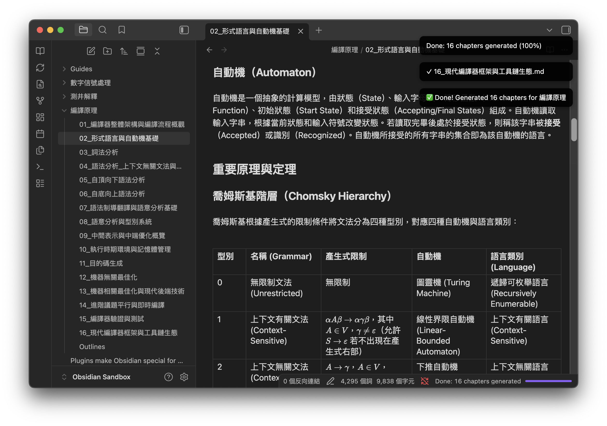

# Knowledge Overview

Knowledge Overview is an Obsidian plugin that uses OpenAI-compatible LLM
providers to generate structured subject overviews, study outlines, and chapter
notes for background learning, course review, and research preparation.

## Features

- Generate a course outline from a subject name.
- Generate one Markdown note per outline chapter.
- Choose a chapter depth for each generation run: map-only scan, usable
  onboarding overview, proper learning chapter, or review mode.
- Classify each chapter by knowledge type before writing it, so conceptual,
  mathematical, procedural, empirical, craft, historical, and hybrid topics use
  different teaching structures.
- Start generation from the command palette or the ribbon icon.
- Resume failed chapters from `Failed_Chapters.md` without regenerating the
  entire outline.
- Use learning-oriented prompts for prerequisite bridges, formulas, examples,
  applications, failure modes, and retrieval questions.
- Check generated chapters for density and glossary-like output, then run one
  repair pass when needed.
- Choose from common European and Asian output languages.
- Include English plus target-language terminology for key concepts and stable
  bilingual Markdown headings.
- Render formulas with Obsidian-compatible KaTeX blocks.
- Configure API base URL, models, knowledge type behavior, output limits,
  provider-specific options, and manual concurrency.
- Show generation progress in the status bar and an updateable notice for
  mobile.
- Retry transient API failures and write failed chapters to `Failed_Chapters.md`.

## Requirements

- Obsidian 1.12.7 or later.
- An API key for Google Gemini, OpenAI, or another OpenAI-compatible provider.

The plugin is not desktop-only. It avoids Electron and Node-only APIs and is
intended to run on both desktop and mobile Obsidian. Mobile network behavior
still depends on the configured provider and the device network environment.

## Installation

### Manual Install

1. Download `main.js`, `manifest.json`, and `styles.css` from the latest
   release.
2. Create this folder in your vault:

   ```text
   <vault>/.obsidian/plugins/knowledge-overview/
   ```

3. Copy the three files into that folder.
4. Reload Obsidian.
5. Enable `Knowledge Overview` in `Settings > Community plugins`.

### From Source

```bash
git clone https://github.com/obafgkm42/obsidian-knowledge-overview.git
cd obsidian-knowledge-overview
npm install
npm run build
```

Then copy `main.js`, `manifest.json`, and `styles.css` into:

```text
<vault>/.obsidian/plugins/knowledge-overview/
```

## Usage

1. Open the command palette.
2. Run `Generate Knowledge Overview`.
3. Enter a subject, for example `Signal Processing`.
4. Choose a chapter depth for this run.
5. The plugin creates a subject folder containing `Outlines.md` and one note
   per generated chapter.

To continue failed chapters later, run `Resume Failed Chapter Generation` from
the command palette or the resume ribbon icon, then enter the subject folder
name. The plugin reads `Failed_Chapters.md` and retries only those chapters.

Example output:

```text
Signal Processing/
├── Outlines.md
├── 01_Fourier_Analysis.md
├── 02_Signal_Filtering.md
└── 03_Wavelet_Transform.md
```

## Demo



## Settings

- `API key`: API key for your provider.
- `API base URL`: OpenAI-compatible API endpoint. Default:
  `https://generativelanguage.googleapis.com/v1beta/openai`.
- `Outline model`: model used for outline generation. Default:
  `gemini-3.5-flash`.
- `Chapter model`: model used for chapter notes. Default:
  `gemini-3.5-flash`.
- `Knowledge type`: use `Auto` for planning-based classification, or force one
  chapter structure: conceptual, mathematical, procedural, empirical, craft,
  historical, or hybrid.
- `Minimum chapter characters`: minimum effective character count used by the
  quality evaluator and repair pass.
- `Auto-expand short chapters`: run one repair pass when a chapter is too
  short, too glossary-like, or missing required sections.
- `Max completion tokens`: `max_completion_tokens` limit for Chat Completions
  output. Increase this if your provider truncates long chapters.
- `Temperature`: optional provider setting. Leave empty to omit it.
- `Reasoning effort`: optional provider-specific setting. Only use it if your
  provider supports it.
- `Verbosity`: optional provider-specific setting. Only use it if your provider
  supports it.
- `Concurrency`: manual course-level concurrency, default `1`.
- `Chapter concurrency`: manual chapter-generation concurrency, default `1`.
- `Language`: target output language.

The default settings favor stability on free or rate-limited providers. Keep
concurrency small unless your provider is stable under parallel requests and
has sufficient rate limits.

Medium-sized or stronger models usually generate richer chapter notes than
small or lite models. Very small models may follow the structure but produce
shorter explanations.

If the network is unstable, transient provider errors are retried automatically.
Any chapters that still fail are listed in `Failed_Chapters.md` inside the
generated subject folder.

If a provider stops a response because it reached the output length limit, the
plugin treats that chapter as failed instead of saving a truncated note. Increase
`Max completion tokens` or switch to a model/provider with a larger output limit,
then run resume generation.

## Chapter Depth

Chapter depth is selected in the generate modal for each run because the right
depth depends on the user's intent for that subject. Higher depth is not just a
style preference: it asks the model to write more learning units, examples,
failure modes, and practice questions, and it can make the result feel dense or
exhausting when you only need a quick map.

| Depth               | Best for                                                                   | Density target                                                                             |
| ------------------- | -------------------------------------------------------------------------- | ------------------------------------------------------------------------------------------ |
| `Map only`          | Scanning a new domain and deciding what matters.                           | Shorter chapters with compact core units and a few examples.                               |
| `Usable overview`   | Becoming operational without reading a mini textbook. This is the default. | Medium-long chapters with explanations, examples, failure modes, and self-check questions. |
| `Teach me properly` | Studying a chapter like a serious lesson.                                  | Long chapters with deeper units, worked examples, assumptions, and practice questions.     |
| `Review mode`       | Refreshing knowledge when you already have background.                     | Compact, high-density review notes with many retrieval questions.                          |

The built-in presets currently send roughly these effective character targets to
the model:

| Depth               | Approximate target       |
| ------------------- | ------------------------ |
| `Map only`          | 3,000-7,000 characters   |
| `Usable overview`   | 9,000-16,000 characters  |
| `Teach me properly` | 16,000-30,000 characters |
| `Review mode`       | 4,000-10,000 characters  |

These numbers are soft targets, not hard caps. The plugin writes them into the
chapter prompt and uses the minimum value in the local quality check and repair
pass, but it does not truncate output at the maximum value. The model, subject
complexity, output language, `Auto-expand short chapters`, and `Minimum chapter
characters` setting can push a chapter higher. German and other long-form
languages can be especially verbose; `Teach me properly` may produce around
50,000 characters for a single chapter on some models.

If you are exploring a new subject, start with `Map only` or `Usable overview`.
Use `Teach me properly` only when you want a deep note and are comfortable with
the time, reading load, API quota, and possible cost.

## Knowledge Types

The plugin no longer treats every chapter as a generic concept summary. For
each chapter it first asks the model to create an instructional plan, then uses
that plan to select a domain adapter:

- `Conceptual`: concepts, mechanisms, abstractions, and tradeoffs.
- `Mathematical`: formulas, models, units, assumptions, and limiting cases.
- `Procedural`: tools, workflows, setup, verification, and troubleshooting.
- `Empirical`: data, backtests, experiments, metrics, leakage, and robustness.
- `Craft`: techniques, materials, sensory or output standards, and fixes.
- `Historical`: timelines, causal forces, transitions, debates, and legacy.
- `Hybrid`: primary structure plus selected requirements from secondary types.

`Knowledge type` is usually best left on `Auto`. Override it when you know a
chapter should be written as a specific kind of lesson.

## Cost and Token Usage

Long-form generation can be expensive. A single subject may generate an outline,
then run planning and chapter generation for every chapter, with possibly one
repair expansion when the first answer is too short or too glossary-like. The
local quality evaluation does not call the API, but the planning, chapter, and
repair steps do. With `Teach me properly`, a single chapter can easily reach
tens of thousands of characters, and some models may produce roughly
10,000-50,000 characters for one chapter after expansion.

This can create a meaningful API bill, especially with:

- many outline chapters,
- high `Chapter concurrency`,
- large `Max completion tokens`,
- `Teach me properly`,
- `Auto-expand short chapters`,
- expensive models,
- providers that charge separately for reasoning or long context.

For cost-sensitive runs, start with `Map only` or `Usable overview`, keep
chapter concurrency at `1`, use a moderate model, and generate one subject
before scaling up. If you use Gemini's free API tier, check the active limits in
Google AI Studio before a large run. Gemini API rate limits vary by model and
project, are measured with per-minute and per-day quotas, and daily request
quotas reset at midnight Pacific time. In practice, some free-tier Gemini models
may allow only around a few dozen requests per day, so one multi-chapter subject
can consume the free allowance quickly.

## Supported Languages

The plugin currently provides presets for English, Simplified Chinese,
Traditional Chinese, Japanese, Korean, Vietnamese, Thai, Indonesian, Malay,
Hindi, Arabic, German, French, Spanish, Italian, Portuguese, Dutch, Swedish,
Finnish, Polish, Turkish, and Russian.

## API Providers

The plugin calls the `/chat/completions` endpoint and should work with Google
Gemini's OpenAI-compatible endpoint, OpenAI, and other OpenAI-compatible
providers. The API base URL is normalized, so values with or without trailing
slashes, `/v1`, or `/chat/completions` are handled. If you enter only a host
with no path, the plugin uses the common `/v1/chat/completions` convention.
Provider quality, latency, context limits, and rate limits directly affect
generation quality and stability.

Common API base URL examples:

| Provider         | API base URL                                              | Example model      |
| ---------------- | --------------------------------------------------------- | ------------------ |
| Google Gemini    | `https://generativelanguage.googleapis.com/v1beta/openai` | `gemini-3.5-flash` |
| OpenAI           | `https://api.openai.com/v1`                               | `gpt-5.5`          |
| Anthropic Claude | `https://api.anthropic.com/v1`                            | `claude-opus-4-7`  |
| DeepSeek         | `https://api.deepseek.com`                                | `deepseek-v4-pro`  |

The plugin appends `/chat/completions` automatically. You can paste either the
base URL above or a full `/chat/completions` URL; both forms are normalized.
For best note quality, prefer mid-sized or stronger models. In practice,
Gemini Flash works well, while lite/small models often produce notes that are
too short.

## Privacy and Security

API keys are stored locally in Obsidian plugin data inside your vault. Do not
publish plugin data files or screenshots containing secrets.

The plugin sends the subject name and generated chapter prompts to the API
provider you configure. It does not include analytics, telemetry, remote code
loading, shell execution, `eval`, or bundled API keys.

Generated Markdown files are written only to your current vault.

## Development

```bash
npm install
npm run dev
```

Build a production bundle:

```bash
npm run build
```

Release artifacts are:

- `main.js`
- `manifest.json`
- `styles.css`

## Project Structure

```text
.
├── main.ts
├── main.js
├── manifest.json
├── versions.json
├── styles.css
├── esbuild.config.mjs
├── package.json
└── tsconfig.json
```

## License

MIT
